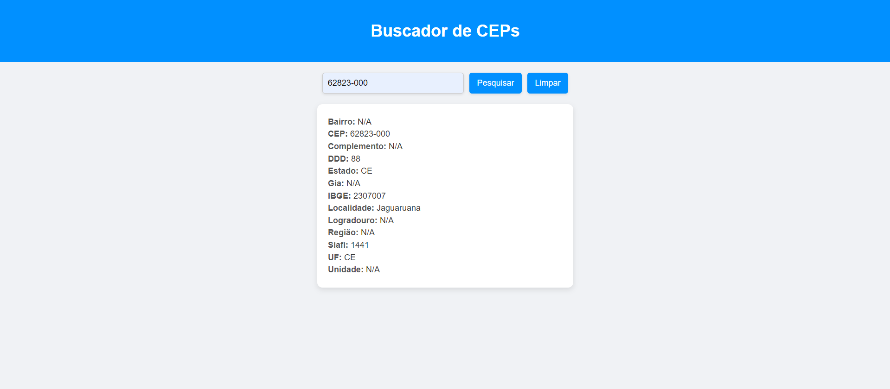

# Projeto de buscar CEPs

Este projeto utiliza uma **API pública** para buscar _CEPs_ A API pode ser ser encontrada no link: https://viacep.com.br.

## Desgin do Projeto



## Uso da APIs

para buscar um CEP pode-se usar a sequinte URL considerando o cep 62823000 como exemplo:

```
https://viacep.com.br/ws/62823000/json
```

A resposta da API é a seguinte
```
{
  "cep": "62823-000",
  "logradouro": "",
  "complemento": "",
  "unidade": "",
  "bairro": "",
  "localidade": "Jaguaruana",
  "uf": "CE",
  "estado": "Ceará",
  "regiao": "Nordeste",
  "ibge": "2307007",
  "gia": "",
  "ddd": "88",
  "siafi": "1441"
}
```